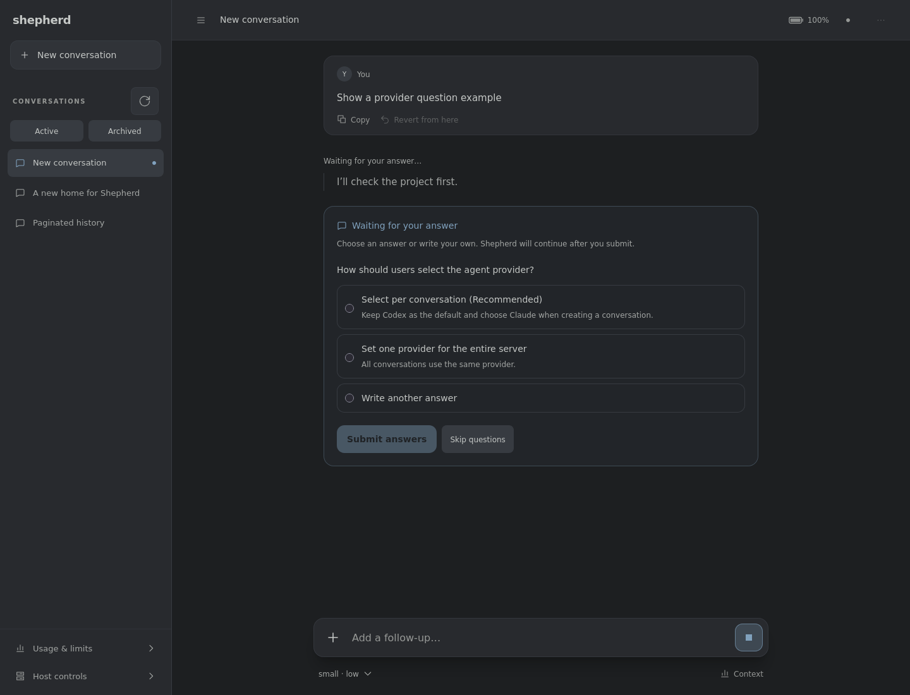
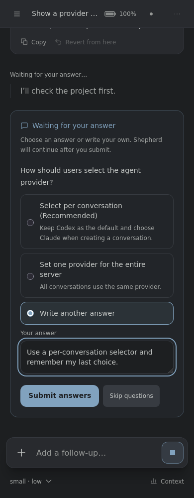
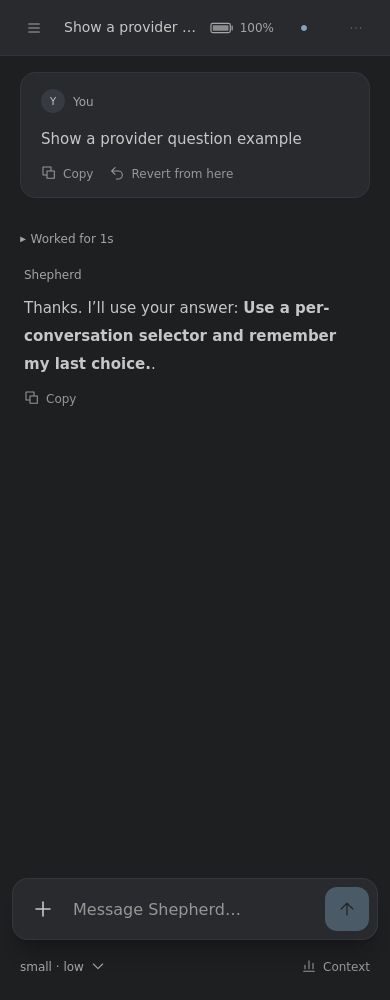

# Answering questions from Shepherd

Reviewed 2026-10-09 against implementation `7e30d66` in [PR #88](https://github.com/triloy8/shepherd/pull/88).

When Codex sends an `item/tool/requestUserInput` request, Shepherd displays a question form. Choose an option or enter a custom answer when offered, then select **Submit answers**. No option is selected automatically. **Skip questions** explicitly returns an empty answer map.

Blocking requests show **Waiting for your answer** and stay pending until you submit, skip, interrupt the turn, or Codex withdraws the request. Nonblocking requests display the questions while Codex continues working. Reloading the web page restores pending questions; unsubmitted answer drafts are local to the form and are not persisted.

Multiple questions are submitted together. Secret answers use password fields, and submitted answers are not copied into approval records or bridge events. The existing pending decision API and events carry these requests through the same routing and lifecycle checks as approvals.

Discord offers an answer modal for up to five nonsecret questions. Secret questions and requests with more than five questions direct users to the web UI. In a Discord modal, enter the exact option label or a custom answer if offered. A conversation can be attached to only one surface at a time: use `!detach` in Discord, then resume that same conversation in web to answer a secret or larger request there. Detaching does not answer or interrupt the pending request.

Questions written only as assistant prose do not create an interactive form.

## Example screenshots

These are Firefox captures of the built Shepherd UI using the local browser fixture and the provider-selection question from the reported example. The follow-up response is fixture data, not a live Codex completion.

### Desktop: waiting for a decision

### Mobile: entering a custom answer

### Mobile: after submitting

To reproduce locally, run `bun run build:ui` and `bun run tests/fixtures/web-ui-host.ts`, open the printed localhost URL, create a conversation, and send `Show a provider question example`.
